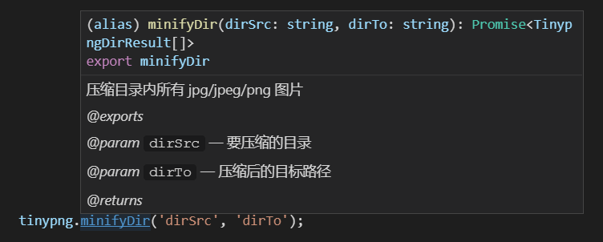

# tinypng-fs

[](https://www.npmjs.com/package/tinypng-fs) [](https://travis-ci.org/shalldie/tinypng-fs)

用 `tinypng` 进行压缩的工具，使用的 `web` 接口，不需要使用 `key`，无数量限制。

已经添加了 `.d.ts` 文件，代码写起来有完整的代码提示 >\_<#@!



# Installation

    npm install tinypng-fs

# Usage

## 上传一个图片到 `tinypng`

```js
const tinypng = require('tinypng-fs');

// 上传一个图片到 `tinypng`

(async () => {
    const result = await tinypng.upload('图片源文件地址.png');
    // 该文件在 tinypng 的地址
    console.log(result.output.url);
})();
```

## 压缩一个图片文件

会上传到 `tinypng` 并下载到指定目录

```js
...
await tinypng.minifiyFile('srcFrom.png', 'srcTo.png');
...
```

## 压缩整个目录

压缩整个目录内所有图片到另一个目录

搜索目录内所有的 `jpg/jepg/png` 格式文件上传压缩，保持原有目录结构到新目录。

```js
...
await tinypng.minifyDir('dirSrc', 'dirTo');
...
```

# 返回值

所有的方法返回的都是一个 `Promise` 对象。

```js
// upload 和 minifyFile 返回的类型 TinypngResponse：

class TinypngResponse {
    /**
     * 上传的图片
     */
    input: {
        /**
         * 图片大小
         */
        size: number,
        /**
         * 图片类型
         * @example image/jpeg
         */
        type: string
    };

    /**
     * 图片压缩后
     */
    output: {
        /**
         * 图片大小
         */
        size: number,
        /**
         * 图片类型
         * @example image/jpeg
         */
        type: string,
        /**
         * 图片宽度
         */
        width: number,
        /**
         * 图片高度
         */
        height: number,
        /**
         * 压缩后/压缩前 比例
         * @example 0.2139
         */
        ratio: number,
        /**
         * 压缩后图片地址
         */
        url: string
    };
}

// minifyDir 压缩整个目录返回的类型 Array<TinypngDirResult> :

class TinypngDirResult extends TinypngResponse {
    /**
     * 图片源地址
     *
     * @type {string}
     * @memberof TinypngDirResult
     */
    imgSrc: string = '';

    /**
     * 图片目标地址
     *
     * @type {string}
     * @memberof TinypngDirResult
     */
    imgTo: string = '';
}
```

# Enjoy it! :D
